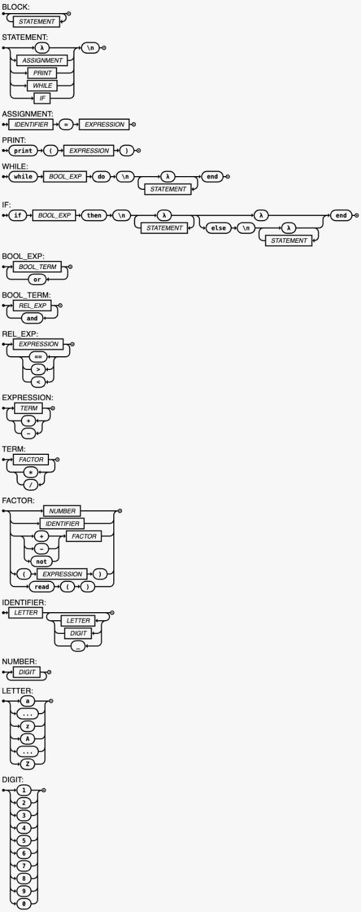

# LogiComp-Compiler

Custom, simplified Lua compiler that generates assembly code for Linux and Windows x86, developed from scratch in C++.
Can also be used to interpret Lua code directly.

## Syntactic diagram 


## Extended Backus-Naur Form (EBNF)

<li>BLOCK = { STATEMENT };
<li>STATEMENT = ( 
    IDENTIFIER, ( "=", BOOL_EXP | "(" , ( | BOOL_EXP, { ( "," ) , BOOL_EXP } ), ")" )
    | "local", IDENTIFIER, ["=", BOOL_EXP] 
    | "print", "(", BOOL_EXP, ")" 
    | "while", BOOL_EXP, "do", "\n", { ( STATEMENT )}, "end" 
    | "if", BOOL_EXP, "then", "\n", { ( STATEMENT ) }, [ "else", "\n", { ( STATEMENT )}], "end"
    | "function", IDENTIFIER, "(", ( | IDENTIFIER, { ( "," ), IDENTIFIER } ), ")", "\n", { ( STATEMENT ) }, "end"
    | "return", BOOL_EXP
    ), "\n" ;
<li>BOOL_EXP = BOOL_TERM, { ("or"), BOOL_TERM } ;
<li>BOOL_TERM = REL_EXP, { ("and"), REL_EXP } ;
<li>EXPRESSION = TERM, { ("+" | "-" |".."), TERM } ;
<li>TERM = FACTOR, { ("*" | "/" | "%"), FACTOR } ;
<li>FACTOR = NUMBER 
    | STRING 
    | IDENTIFIER, ( | "(" , ( | BOOL_EXP, { ( "," ) , BOOL_EXP } ), ")" ) 
    | ("+" | "-" | "not"), FACTOR 
    | "(", BOOL_EXP, ")" 
    | "read", "(", ")" ;
<li>IDENTIFIER = LETTER, { LETTER | DIGIT | "_" } ;
<li>NUMBER = DIGIT, { DIGIT } ;
<li>LETTER = ( "a" | "..." | "z" | "A" | "..." | "Z" ) ;
<li>DIGIT = ( "1" | "2" | "3" | "4" | "5" | "6" | "7" | "8" | "9" | "0" ) ;
<li>STRING = '"', ({LETTER | DIGIT | "_"}), '"';

## Usage
Compile using g++:
```bash
g++ -Wall -O3 -w main.cpp -o main -std=c++17
```
Run the compiler:
```bash
./main program.lua
nasm -f elf -o program program.o # For Linux
nasm -f win32 -o program program.o # For Windows
gcc -m32 -o program program.o
./program
```
Run in interpreter mode:
```bash
./main program.lua -i
```

## Test status

