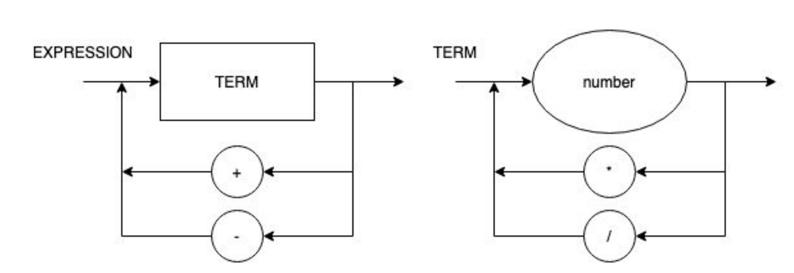

# LogiComp-Compiler

## Syntactic diagram 

## Extended Backus-Naur Form (EBNF)

<li>BLOCK = { STATEMENT };
<li>STATEMENT = ( λ | ASSIGNMENT | PRINT), "\n" ;
<li>ASSIGNMENT = IDENTIFIER, "=", EXPRESSION ;
<li>PRINT = "print", "(", EXPRESSION, ")" ;
<li>EXPRESSION = TERM, { ("+" | "-"), TERM } ;
<li>TERM = FACTOR, { ("*" | "/"), FACTOR } ;
<li>FACTOR = (("+" | "-"), FACTOR) | NUMBER | "(", EXPRESSION, ")" | IDENTIFIER ;
<li>IDENTIFIER = LETTER, { LETTER | DIGIT | "_" } ;
<li>NUMBER = DIGIT, { DIGIT } ;
<li>LETTER = ( a | ... | z | A | ... | Z ) ;
<li>DIGIT = ( 1 | 2 | 3 | 4 | 5 | 6 | 7 | 8 | 9 | 0 ) ;

## Test status

