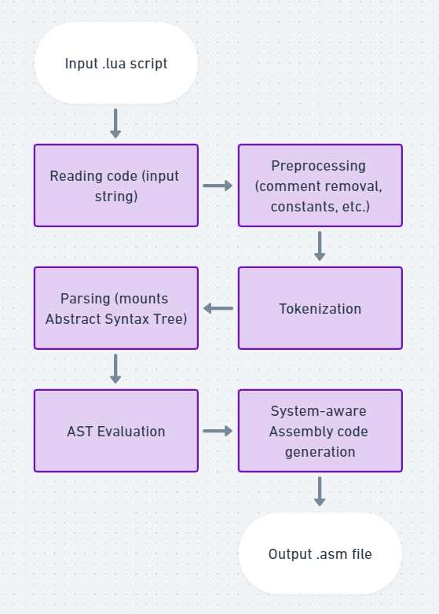
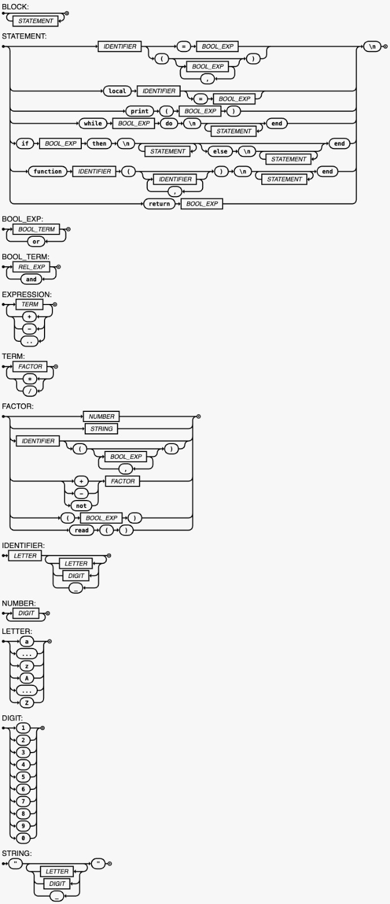

# LogiComp-Compiler

Custom, simplified Lua compiler that generates assembly code for Linux and Windows x86, developed from scratch in C++.

WARNING: This was made for educational purposes only. It is not intended to be used in production as it is not optimized and has many limitations compared to the original Lua compiler.

## Compiler structure

The compiler is divided into the following modules:
- **Main.cpp**: Main module that reads the input file and calls the other modules.
- **Preprocessor.h**: Preprocessor module that handles preprocessor directives and macros.
- **Tokenizer.h**: Tokenizer module that reads the input file and generates tokens.
- **Parser.h**: Parser module that generates the abstract syntax tree (AST) from the tokens.
- **Node.h**: Node module that defines the nodes of the AST.
- **SymbolTable.h**: Symbol table module that stores the variables and functions of the program (and their types).
- **Assembly.h**: Assembly module that generates the assembly code from the AST and the symbol table.



## Syntactic diagram 
This diagram shows how the Lua language is seen by the compiler´s parser, after the tokens are generated by the tokenizer.



## Extended Backus-Naur Form (EBNF)

<li>BLOCK = { STATEMENT };
<li>STATEMENT = ( 
    IDENTIFIER, ( "=", BOOL_EXP | "(" , ( | BOOL_EXP, { ( "," ) , BOOL_EXP } ), ")" )
    | "local", IDENTIFIER, ["=", BOOL_EXP] 
    | "print", "(", BOOL_EXP, ")" 
    | "while", BOOL_EXP, "do", "\n", { ( STATEMENT )}, "end" 
    | "if", BOOL_EXP, "then", "\n", { ( STATEMENT ) }, [ "else", "\n", { ( STATEMENT )}], "end"
    | "function", IDENTIFIER, "(", ( | IDENTIFIER, { ( "," ), IDENTIFIER } ), ")", "\n", { ( STATEMENT ) }, "end"
    | "return", BOOL_EXP
    ), "\n" ;
<li>BOOL_EXP = BOOL_TERM, { ("or"), BOOL_TERM } ;
<li>BOOL_TERM = REL_EXP, { ("and"), REL_EXP } ;
<li>EXPRESSION = TERM, { ("+" | "-" |".."), TERM } ;
<li>TERM = FACTOR, { ("*" | "/" | "%"), FACTOR } ;
<li>FACTOR = NUMBER 
    | STRING 
    | IDENTIFIER, ( | "(" , ( | BOOL_EXP, { ( "," ) , BOOL_EXP } ), ")" ) 
    | ("+" | "-" | "not"), FACTOR 
    | "(", BOOL_EXP, ")" 
    | "read", "(", ")" ;
<li>IDENTIFIER = LETTER, { LETTER | DIGIT | "_" } ;
<li>NUMBER = DIGIT, { DIGIT } ;
<li>LETTER = ( "a" | "..." | "z" | "A" | "..." | "Z" ) ;
<li>DIGIT = ( "1" | "2" | "3" | "4" | "5" | "6" | "7" | "8" | "9" | "0" ) ;
<li>STRING = '"', ({LETTER | DIGIT | "_"}), '"';

## Usage
Compile the compiler using g++:
```bash
g++ -Wall -O3 -w main.cpp -o main -std=c++17
```
Run the compiler:
```bash
./main program.lua
nasm -f elf -o program.o program.asm # For Linux
nasm -f win32 -o program.o program.asm # For Windows
gcc -m32 -o program program.o
./program
```

## Test status

